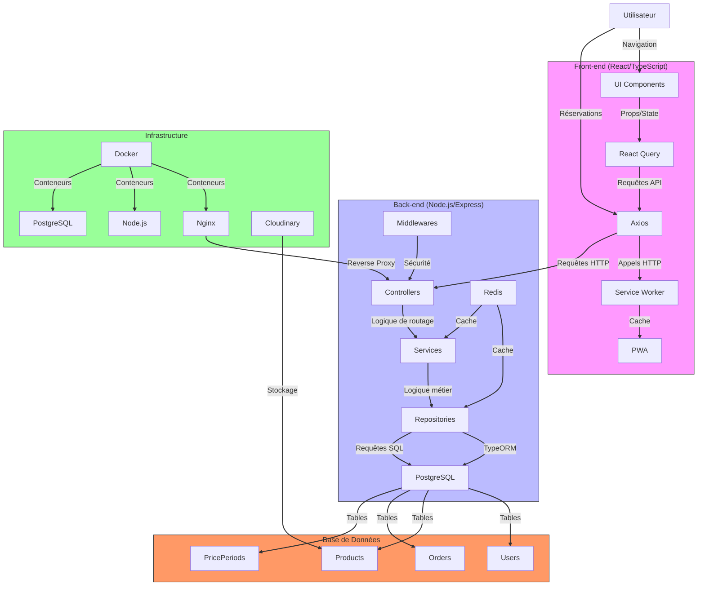

# Architecture Shu-no

```mermaid
%% Diagramme d'architecture globale de Shu-no
graph TD
    %% ----- Couche Front-end -----
    subgraph Front-end ["Front-end (React/TypeScript)"]
        A[UI Components] -->|"Props/State"| B[React Query]
        B -->|"Requêtes API"| C[Axios]
        C -->|"Appels HTTP"| D[Service Worker]
        D -->|"Cache"| E[PWA]
        style Front-end fill:#f9f,stroke:#333
    end

    %% ----- Couche Back-end -----
    subgraph Back-end ["Back-end (Node.js/Express)"]
        F[Controllers] -->|"Logique de routage"| G[Services]
        G -->|"Logique métier"| H[Repositories]
        H -->|"TypeORM"| I[PostgreSQL]
        J[Middlewares] -->|"Sécurité"| F
        K[Redis] -->|"Cache"| H
        style Back-end fill:#bbf,stroke:#333
    end

    %% ----- Couche Base de Données -----
    subgraph Database ["Base de Données"]
        I -->|"Tables"| L[Users]
        I -->|"Tables"| M[Products]
        I -->|"Tables"| N[Orders]
        I -->|"Tables"| O[PricePeriods]
        style Database fill:#f96,stroke:#333
    end

    %% ----- Couche Infrastructure -----
    subgraph Infrastructure ["Infrastructure"]
        P[Docker] -->|"Conteneurs"| Q[Nginx]
        P -->|"Conteneurs"| R[Node.js]
        P -->|"Conteneurs"| S[PostgreSQL]
        Q -->|"Reverse Proxy"| F
        T[Cloudinary] -->|"Stockage"| M
        style Infrastructure fill:#9f9,stroke:#333
    end

    %% ----- Interactions -----
    C -->|"Requêtes HTTP"| F
    H -->|"Requêtes SQL"| I
    K -->|"Cache"| G
    U[Utilisateur] -->|"Navigation"| A
    U -->|"Réservations"| C

    %% ----- Légende -----
    linkStyle default stroke-width:2px
    classDef front fill:#f9f,stroke:#333
    classDef back fill:#bbf,stroke:#333
    classDef db fill:#f96,stroke:#333
    classDef infra fill:#9f9,stroke:#333
```
